# 图片翻译结构化训练数据项目案例

## 项目概览

项目为图片翻译模型构建结构化训练数据，重点解决 OCR 行合并翻译判定、渲染样式一致性分析、容器结构和阅读顺序问题。数据来源同时包含 HTML 合成数据和 VLM 难例标注数据：HTML 合成分支可规模化生产约 50 万份像素级标注样本，VLM 标注分支累计整理约 2 万张跨场景难例数据。

## 可视化结果

### VLM 标注与行关系

这组图展示 OCR 行级结构化标注效果，用于复核合并翻译、单独翻译、阅读顺序和样式一致性。可视化验收工具将行级关系绘制回原图，帮助定位跨栏、跨容器和长距离关系判断错误，黄色连线表示合并ocr行翻译，红色圆圈表示单独ocr行翻译。

| 示例 1 | 示例 2 | 示例 3 |
| --- | --- | --- |
| 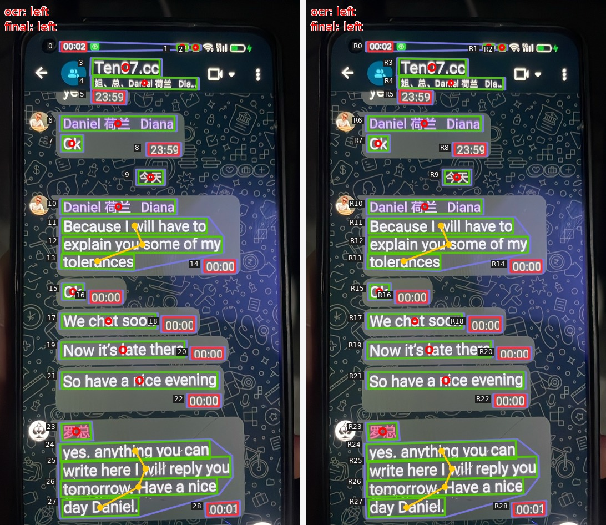 | 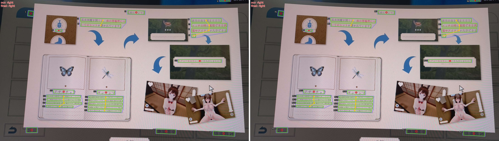 | 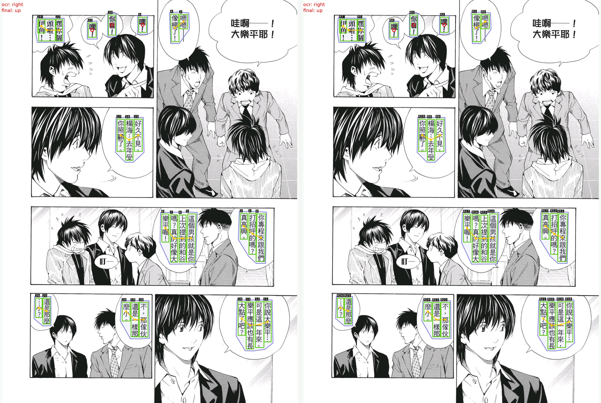 |

| 示例 4 | 示例 5 | 示例 6 |
| --- | --- | --- |
| 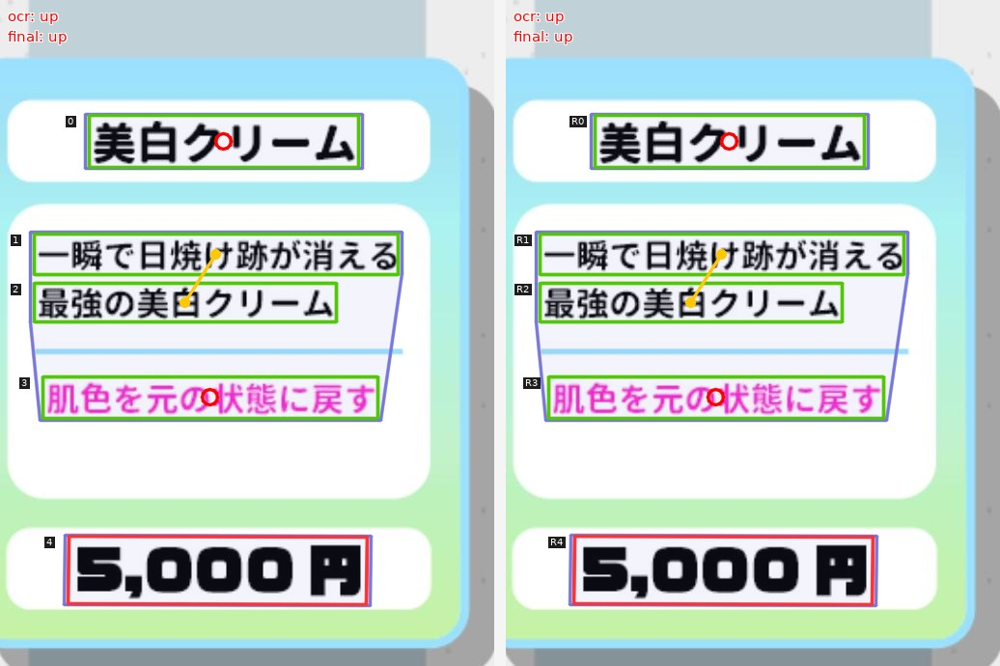 | 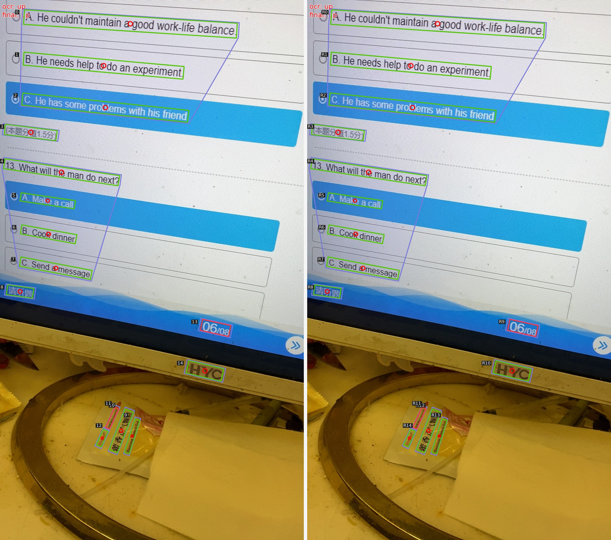 | 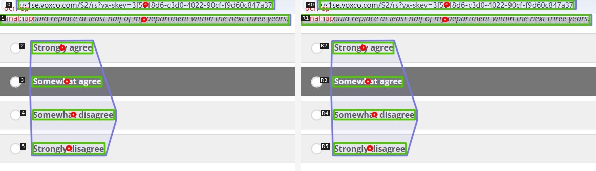 |

### HTML 论文图表合成数据

这组图展示 HTML 生成的论文 / 图表类合成页面。HTML 合成分支通过颜色注入标记页面元素，再从渲染结果中反解元素像素级位置，用于生成带 bbox / polygon 真值的训练样本。

| 样例 1 | 样例 2 | 样例 3 |
| --- | --- | --- |
| 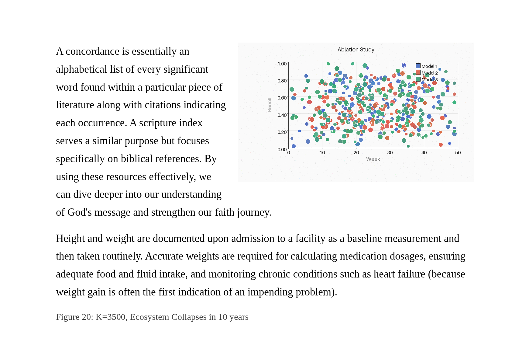 | 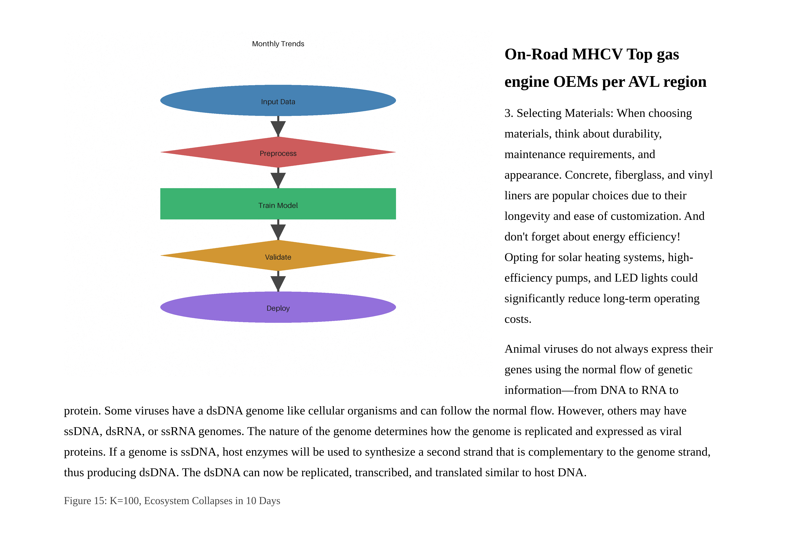 | 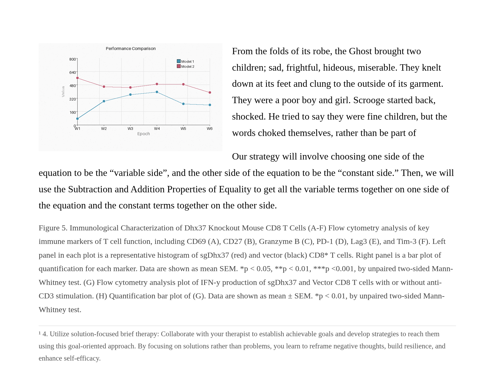 |

| 样例 4 | 样例 5 |
| --- | --- |
| 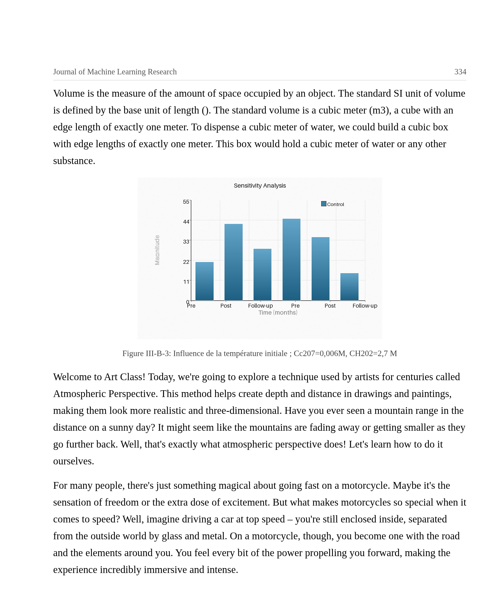 | 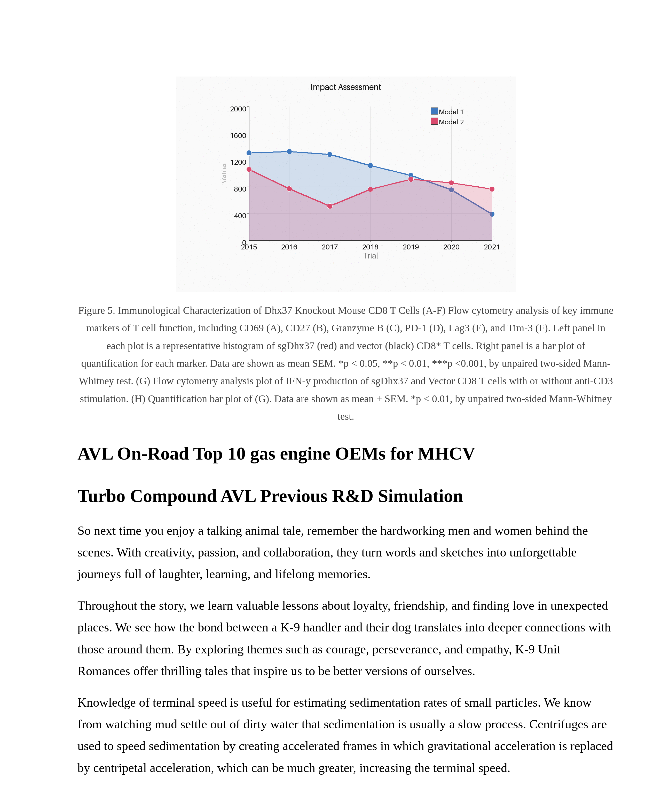 |

### HTML 英语试卷合成数据

这组图展示 HTML 生成的英语试卷封面、A3 双页和阅读理解等合成场景，用于扩充图片翻译在长文档、试卷和多栏版面中的结构覆盖。

| A3 双页 | A4 封面 | 阅读理解 |
| --- | --- | --- |
| 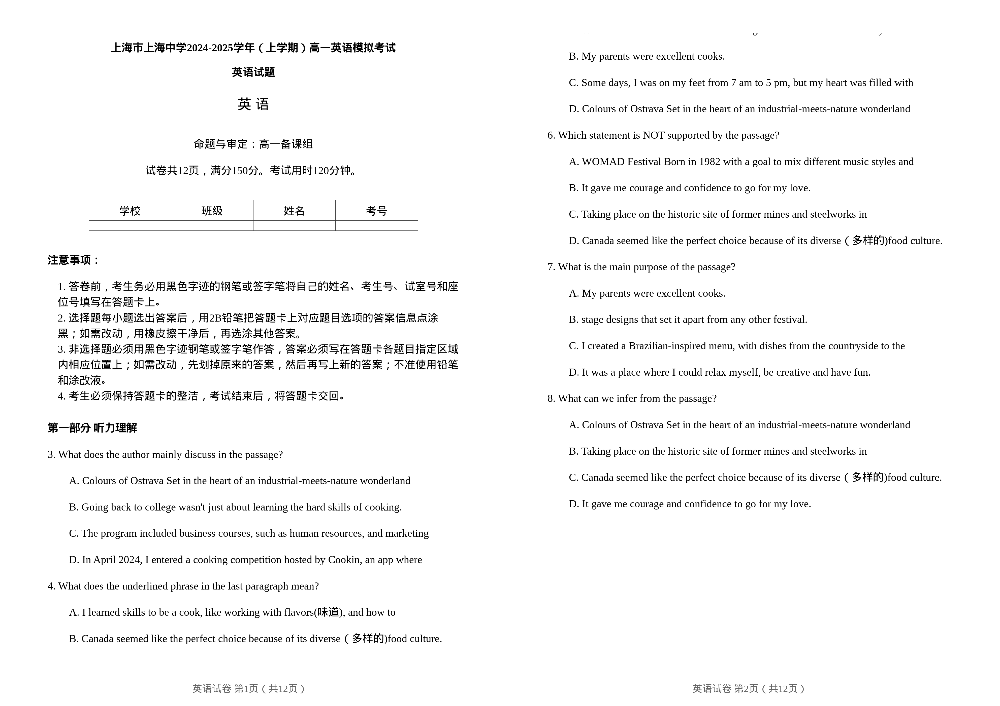 | 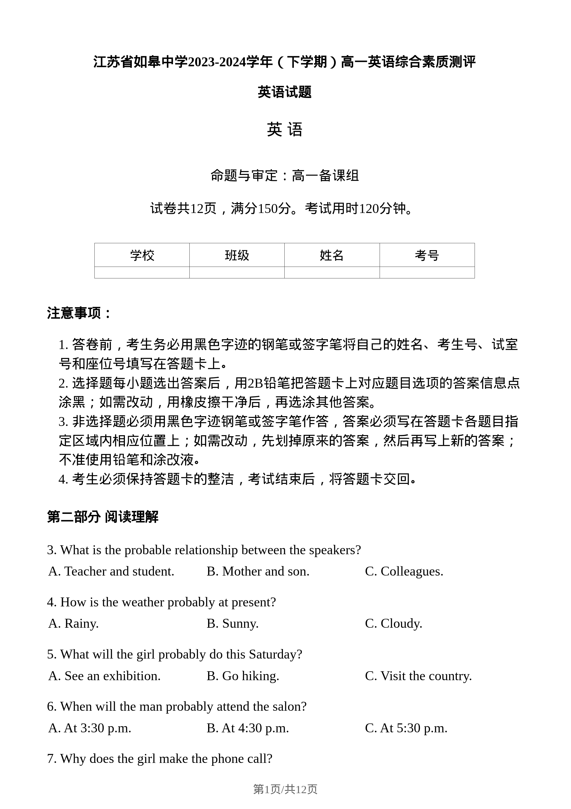 | 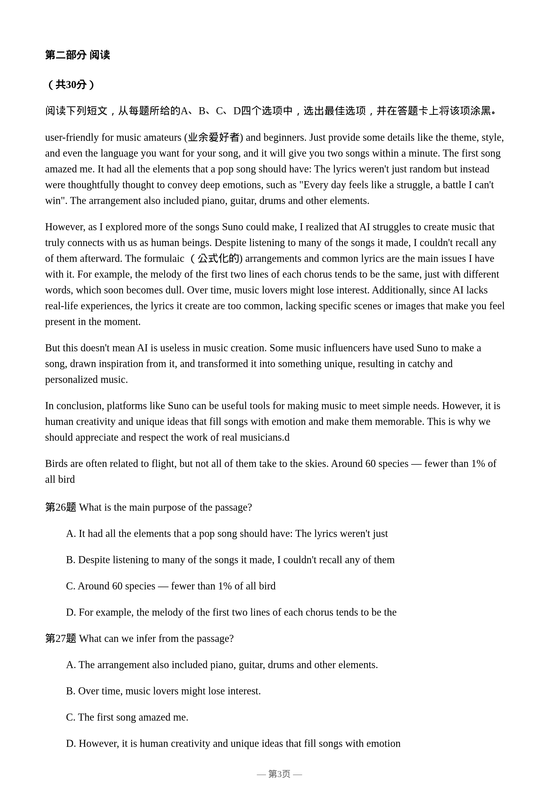 |

## 项目在做什么

数据体系由两部分组成：一是基于 HTML 和 Playwright 的合成数据生成，二是基于 VLM 的多阶段图片结构化标注。HTML 分支负责低成本、大规模构造可控版式与像素级真值；VLM 分支负责真实复杂版式中的难例理解。最终数据经过 Schema 校验、物理规则筛选、可视化验收和阅读顺序修复后进入模型训练链路。

## 遇到的困难

1. OCR 行之间的语义关系不能只由距离和相对位置决定，复杂版式中存在跨栏、跨容器和长距离归属问题。
2. HTML 渲染结果需要从像素层面反解元素位置，否则只能得到 DOM 级结构，无法直接变成视觉模型训练标签。
3. VLM 输出结构容易出现格式错误、越界坐标和阅读顺序不一致。
4. 场景类型多，单一 Prompt 或单一规则难以覆盖漫画、菜单、书页、UI 和表格。

## 解决方案

1. 把 OCR 行合并翻译判定建模为行关系预测，使用 OCR 行文本、bbox、尺寸和序号等信息进行结构化建模。
2. 设计 HTML 颜色注入机制：渲染时为元素写入唯一颜色编码，再从截图像素中反解元素区域，获得可直接训练的 bbox / polygon 标签。
3. 建立方向、容器 / 场景、翻译单元 / 阅读顺序的三阶段 VLM 标注流程，并为每一阶段维护版本化提示词和测试样例。
4. 用 Schema 校验、物理规则筛选和阅读顺序自动修复组成质量门，将大模型的开放式输出转成可入库的数据。

## 结果与验证

- HTML 合成数据系统可生产约 50 万份像素级标注样本；
- 10 类真实场景、约 2 万张 VLM 难例结构化标注图片；
- Stage 1 / Stage 2 提示词分别迭代 87 / 90 版；
- 重要场景文本行关系预测 F1：书本约 95.0%，广告 / 漫画约 96.6%；
- 合并判定准确率从 0.878 提升至 0.955，表示合并 / 单独翻译判断的整体正确率提升；
- 合并预测精确率从 0.857 提升至 0.947，表示系统预测为“需要合并翻译”的样本命中率提升。

## 业务价值

项目把图片翻译中的版式理解从几何规则问题扩展为可训练、可评测、可迭代的数据工程问题。HTML 合成分支提供大规模、低成本、可控的像素级真值样本；VLM 难例分支补齐真实复杂版式中的跨容器、跨栏和长距离归属问题。

## 闭环总结

版式关系难以靠规则覆盖 → HTML 合成数据规模化补充基础样本 → VLM 分阶段标注真实难例 → 自动校验和规则筛选 → 可视化验收定位坏例 → 修复与版本迭代 → 数据入库与线上评测。

## 可视化图说明

`assets/可视化图/` 按用途拆分为三类：

- `01_VLM标注可视化/`：展示 OCR 行关系、翻译单元合并、阅读顺序和样式一致性标注效果。
- `02_HTML论文图表合成数据/`：展示 HTML + Playwright 生成的论文 / 图表类合成页面。
- `03_HTML英语试卷合成数据/`：展示 HTML + Playwright 生成的英语试卷封面、双页和阅读理解场景。

图片采用统一编号命名，不包含本地路径、原始文件名、生产日志或内部标注文件。

## 证据与假设

- **事实：**当前已整理 VLM 标注、HTML 合成和英语试卷合成三类脱敏可视化图，用于支撑作品集展示。
- **说明：**数据标注成本下降比例未作为公开指标展示，避免把未复核估算写成正式结论。
